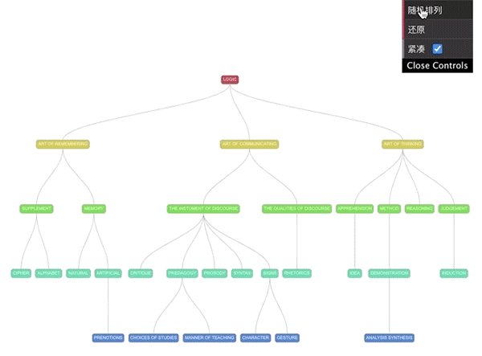
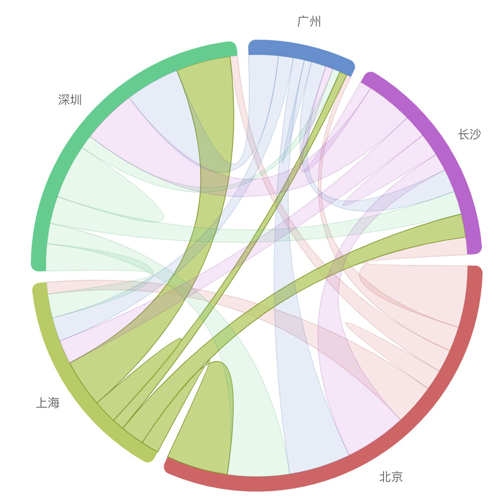
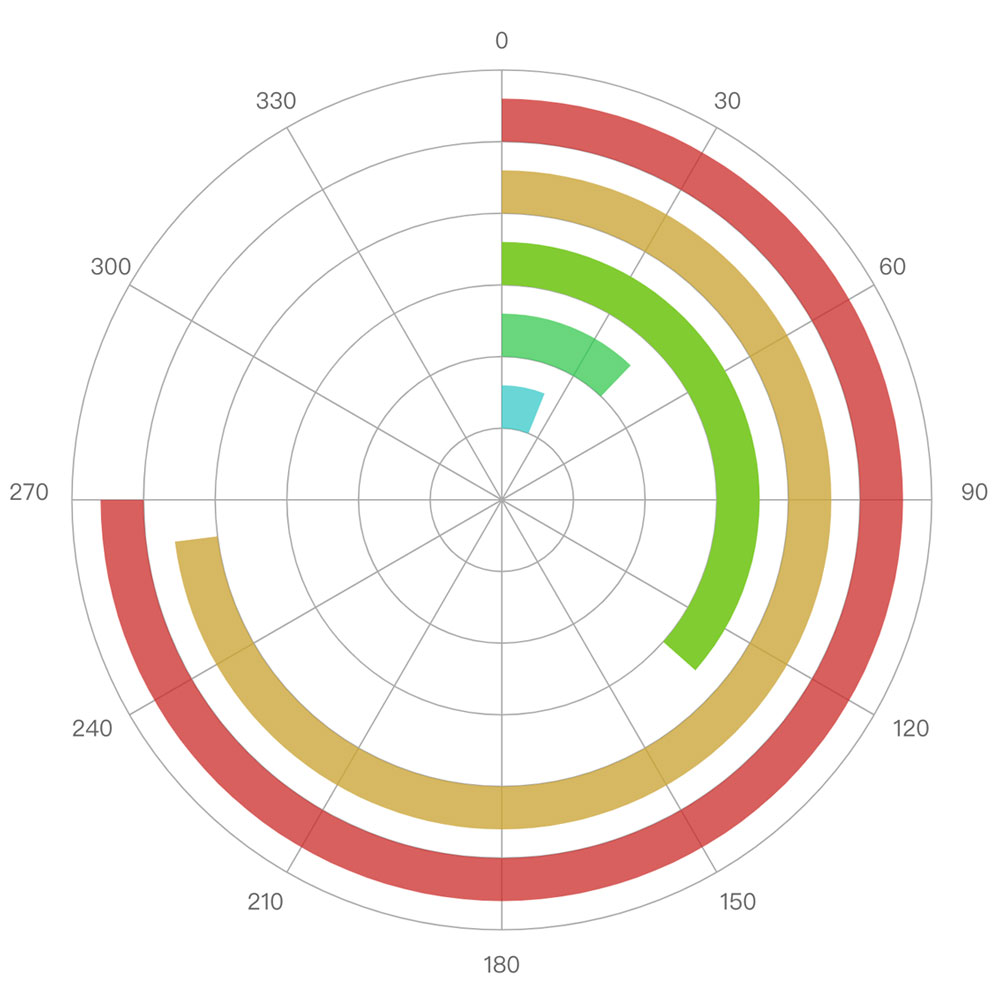

# CRK

---

​**crk** (canvas rendering kit, canvas 渲染工具集) 是基于原生 canvas api 的超轻量绘制引擎, 包含完整 **图形类**, **事件系统**, **矩阵系统**, 可轻松实现 canvas 中的各种图形绘制

<p align="center">
  &emsp;
  
</p>
<p align="center">
  &emsp;
  
</p>

#### 安装

```javascript
// npm
npm i @mikixing/crk

// yarn
yarn add @mikixing/crk
```

#### API

[API 文档](https://github.com/mikixing/crk/blob/master/API.md)

#### 示例

绘制闭合图形

```javascript
import { Shape, Group, Stage } from '@mikixing/crk'

const stage = new Stage(canvas)
const shape = new Shape()
const grp = new Group()

grp.addChild(shape)
stage.addChild(grp)

shape.graphics
  .setStrokeStyle({
    color: '#f70',
    lineWidth: 2,
    gap: 'round',
    join: 'round',
  })
  .setFillStyle('#6cf')
  .moveTo(50, 300)
  .bezierCurveTo(80, 70, 260, 50, 310, 300)
  .closePath()
  .stroke()
  .fill()
stage.update()
```

#### 对比 easeljs

`crk` 在部分接口定义上, 借鉴了 `easeljs`, 但内部实现原理完全不同, 主要包含以下几点:

- **轻量** - `crk` 在 **Gzip** 压缩后体积仅为 `8KB`, 但却包含了 canvas 图形绘制中最重要的 `图形类, 事件, 矩阵`
- **支持填充规则 winding rule**, `easeljs` 常因无法设置此功能而让人诟病, 这也是我开发 `crk` 的一大原因. `crk` 的 `graphics` 模块尽量模拟原生 canvas api 写法
- **不支持\*Filter、 StageGL、Spirite 等** - 个人觉得这些功能对于一个功能纯粹的 2D 渲染库意义不大, 可拆分到独立的项目中, 或由业务开发实现

#### 协议

MIT
